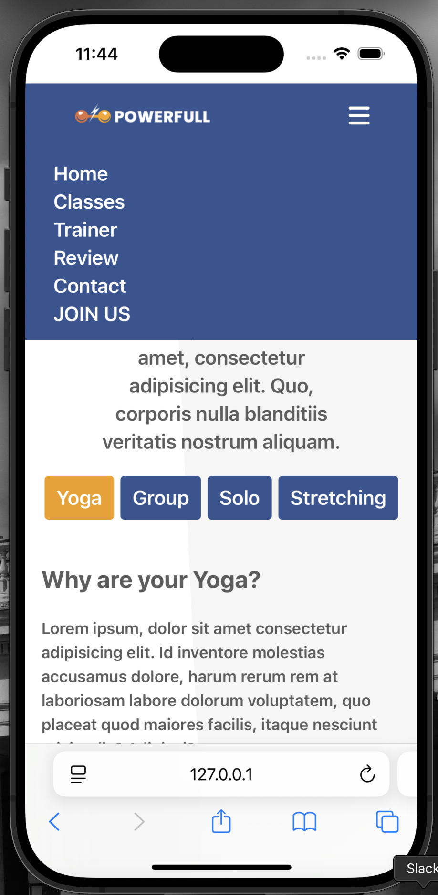
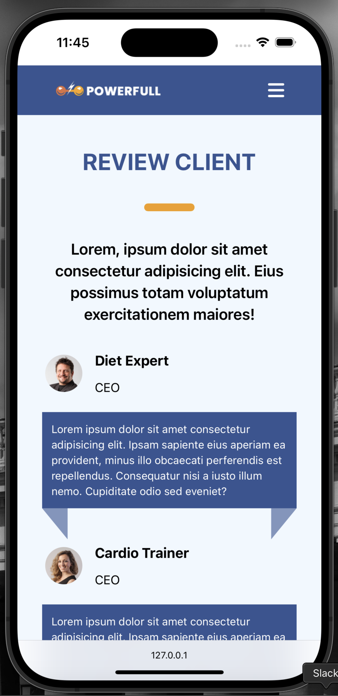
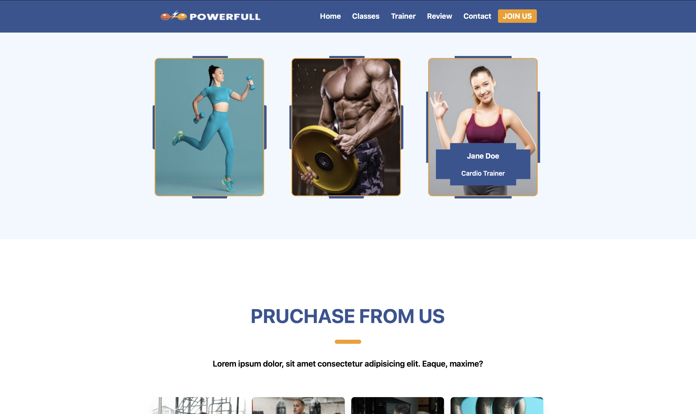

# Project Sport Center

## HTML, CSS and JavaScript 

It is a project created using HTML, CSS and JavaScript. 

#### I used TailwindCSS as the CSS library.
Lastly, I worked with Vite.

### I created a structure that can be used with all devices.

 
 

